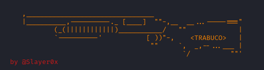

# Trabuco 💥

Trabuco is a tool that seeks to automate repetitive processes in any pentest, it is designed in such a way that it is very easy to implement new functionalities, being very adaptive to any scenario or requirement.

<p align="center">
    
</p>

## Installation

Clone the repository.

```bash
  cd trabuco
  chmod +x install.sh
  sudo ./install.sh
  sudo pyhton3 Trabuco.py
```
    
## Usage/Examples

```bash
usage: Trabuco.py [-h] [-a] [-b] [-u] [-s] [-p] [-d] [-f] [-t] [-g] Network

Trabuco Help Menu

positional arguments:
  Network     Network range to scan (e.g., 192.168.0.0/24)

options:
  -h, --help  show this help message and exit
  -a          Run all Trabuco checks
  -b          Check for SNMP default servers
  -u          Check for Users + RID Brute
  -s          Check for Shares
  -p          Check for Password Policies
  -d          Check for default SSH credentials
  -f          Check for default FTP credentials
  -t          Check for default Telnet credentials
  -g          Screenshot available Web Servers

Examples:
         1. python3 Trabuco.py -a 192.168.1.0/24 -> Run all checks
         2. python3 Trabuco.py -usp 192.168.1.0/24 -> Run only AD Checks
         3. python3 Trabuco.py -df 192.168.0.0/16 -> Runs checks for FTP/SSH Default Creds
         4. python3 Trabuco.py -g 192.168.0.0/16 -> Scans and saves Screenshots from Web Servers

```


## Contributing

Contributions are always welcome, send a PR if you implement any new functionalities!
